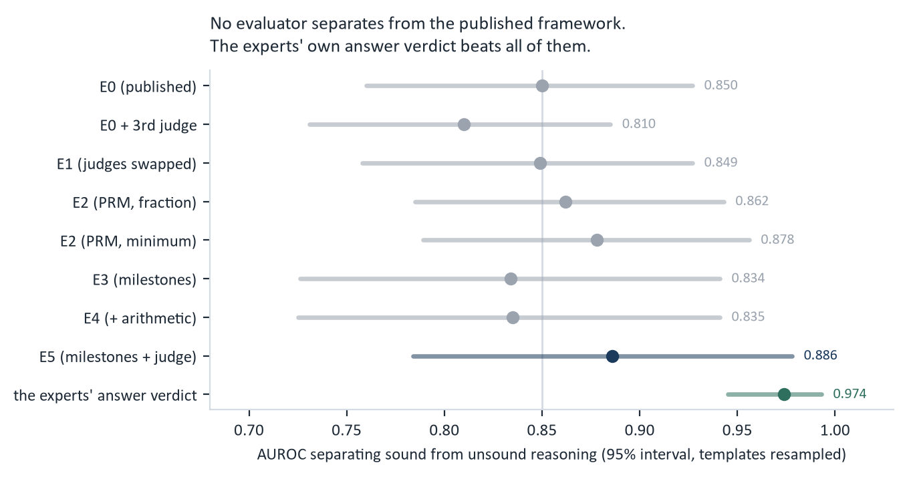
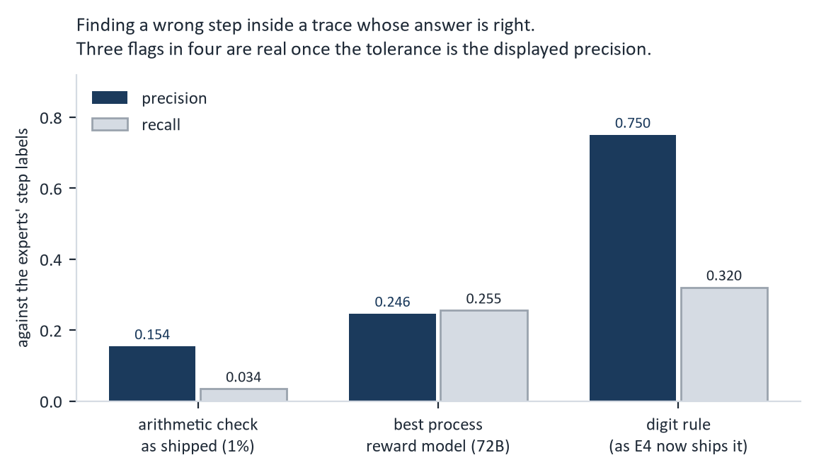
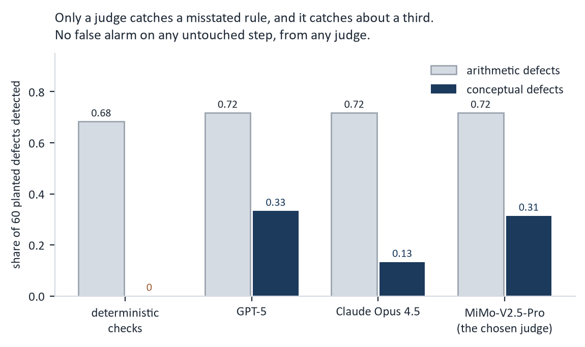
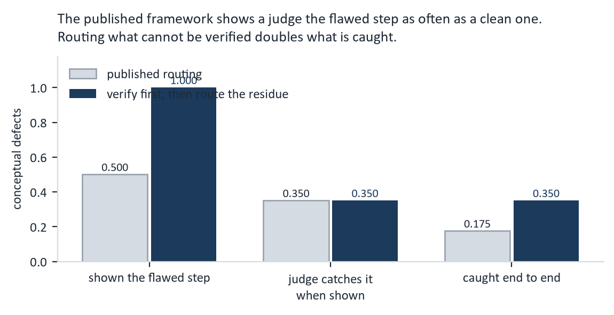
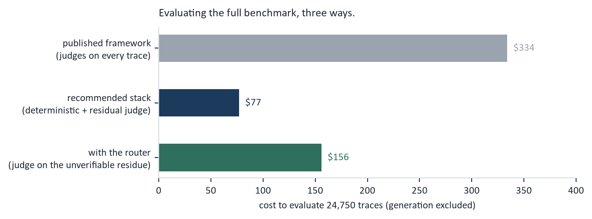

# The EngTrace evaluator pilot

**September 2026. What we ran, what we learned, and how the full benchmark will be scored.**

The pilot asked one question: *how should EngTrace evaluate reasoning at full scale, and is
the published framework the right instrument?* Six candidate evaluators were run over a
frozen slice of the benchmark, scored against labels from 15 domain experts, and stress
tested with defects we planted ourselves. This is the result.

**In short.** The published framework spends its budget on LLM judges and reports a number
that is mostly answer correctness, measured with a parser that is wrong on a quarter of
traces. A deterministic stack scores the same traces more accurately for a fraction of the
cost, and a judge is worth paying for in exactly one place: the steps no checker can verify.

---

## 1. How the pilot was built

### 1.1 The frozen slice

60 problems drawn from five engineering branches and three difficulty levels: 15 templates
with four instances each. The slice is frozen with a recorded master seed and a manifest
hash, and every scoring run re-derives it and compares bytes before it is allowed to score,
so two runs months apart are known to have read the same problems.

Five models generated solutions, giving **300 traces**. Two smaller models were added as a
robustness cohort, checked mechanically but not scored as results.

### 1.2 The six candidates

| | what it computes | headline score |
|---|---|---|
| **E0** | the published framework: semantic step matching, then a panel of LLM judges on the steps it cannot match | share of reference steps recovered |
| **E0-3J** | E0 with its third judge connected, which in the published code was never actually called | same |
| **E1** | E0's method with all three judges replaced by families outside the evaluated suite | same |
| **E2** | three open process reward models scoring every step, run on local GPUs | fraction of steps above the reward threshold, and the minimum step reward |
| **E3** | deterministic milestone verification: did the trace state the quantities a correct derivation must reach, order free and unit aware | milestone coverage |
| **E4** | E3 plus a check of every arithmetic claim the trace displays | coverage, plus arithmetic consistency |
| **E5** | E3 first, then one judge only on the milestones E3 cannot settle | strict milestone coverage |

All six scored the same 300 traces, resumable and keyed by a configuration hash, so a change
in scoring cannot be confused with a change in data.

### 1.3 The expert labels

15 domain experts, three per branch. Every trace was labelled by three experts **of its own
branch**, each producing:

* a label for every step: correct, alternative correct, incorrect, or not a claim, with an
  error type and a written reason when incorrect;
* a status for every milestone the template defines;
* a verdict on the final answer: correct, partial, incorrect, or not stated;
* an overall verdict on whether the reasoning was sound.

Traces were blinded behind opaque codes, assignment was fixed in advance, and a shared
calibration set was labelled across branches so that agreement *between* branches could be
distinguished from agreement *within* one. 1,020 submissions in total, about 13 hours of
expert time.

### 1.4 Three quality rounds

These turned out to matter more than the labelling itself.

1. **A reason on every step called incorrect.** All 1,042 of them. Without this a
   disagreement cannot be adjudicated, only counted.
2. **Verification.** Each expert re-labelled seven of their own traces, blind to their first
   pass. This measures self-consistency, which is the ceiling that any between-expert
   agreement should be read against.
3. **Adjudication.** Every step where a branch's three experts split 2 to 1 went back to all
   three, blind, with the three original labels shown anonymised and shuffled so no reviewer
   could tell which was their own. The majority of that second pass became the label. 272
   split steps across 134 traces.

Two of the fifteen label sets were re-annotated after verification identified them as least
self-consistent. Both originals were kept.

### 1.5 How the comparisons were computed

* **Intervals.** 2,000 bootstrap resamples on every comparison, with each evaluator's
  difference from the published framework computed on the same resamples, so a paired
  comparison is not reported as two independent ones.
* **Clustering.** The 300 traces are 15 templates with four instances each, and instances of
  a template are the same problem with different numbers. Every headline comparison is
  therefore also reported with **templates** resampled rather than traces.
* **Power.** From the clustered standard error, the smallest difference detectable at 80%
  power and 95% confidence, which is what turns a null result into a statement about what the
  design can see.
* **Baselines.** Two: the framework's own answer check, and the experts' answer verdict,
  which is the best any answer check could do.

### 1.6 Planted defects

Two objections follow any result drawn from the labels. The arithmetic rule we tested is the
same rule the annotation guide gave the experts, so their agreement is partly built in. And
conceptual error behind a correct answer cannot be studied on this corpus at all: the experts
found three such steps against 175 calculation slips.

So we built a set whose ground truth is true **by construction**. From the 129 traces the
experts called clean, each receives exactly one defect:

| family | n | what changes | what is held fixed |
|---|---|---|---|
| arithmetic | 60 | one digit of one displayed intermediate value | later steps and the final answer |
| conceptual | 60 | the reasoning a step states: a criterion flipped, a rule misstated, a stated formula contradicting the one actually used | **every digit in the trace** |
| control | 60 | nothing | everything |

Each plant is verified without the checker under test: an arithmetic plant is proved wrong by
recomputing the claim at full precision or against the template's own milestone value, and a
conceptual plant must leave the trace's digit string byte identical. The build is seeded and
reproduces exactly.

---

## 2. What we found

### 2.1 The final answer decides the trace-level verdict

The experts' own final-answer verdict predicts their soundness verdict better than any
evaluator does. Of 228 traces with a correct final answer, their holistic verdict calls only
**three** unsound.

This is structural rather than incidental: **a trace-level score cannot rank reasoning
evaluators**, because it mostly measures whether the answer is right. Everything that
distinguishes the candidates happens at the step and milestone level, which is where the rest
of the pilot works.

### 2.2 The published answer check is wrong on a quarter of traces

It disagrees with the experts on **72 of 300**, and almost always in one direction: 68 are
traces the experts call correct and it calls wrong. In 45 of those, the correct value is
present in the trace's own answer line.

Three defects cause it. The reference answer line often restates the question's inputs, and
the first number on it is read as the answer. A third of the templates answer with a word
rather than a number. And the reference value itself is taken as "the last number in the
solution", which for one template is the exponent inside the unit `m^3/s`, so a trace was
scored correct or wrong according to whether it wrote its units in ASCII.

| answer accuracy | experts | published framework | corrected check |
|---|---|---|---|
| strongest model | 0.950 | **0.617** | 0.950 |
| all 300 traces | 0.760 | **0.547** | 0.753 |

**The benchmark understates every model by about 21 points and mis-ranks the top.** The
replacement is deterministic and needs no model:

1. read the trace's answer segment from its final-answer heading rather than its last
   "Answer" marker, so a multi-part answer is not truncated to its last part;
2. take each target from a quantity the reference **computed**, not from any number it
   prints, which removes restated inputs and formula constants without per-template rules;
3. score every part separately and return **correct, partial or incorrect**, because 19 of
   the 300 traces are genuinely partial and a binary check cannot represent them;
4. accept a value within a relative tolerance **or** within one unit of the last digit it
   displays, or of the reference's, since `114` for 113.55 is a correct rounding while
   `50.20` for 50.05 claims two decimals and gets them wrong;
5. allow unit factors, and read superscripts, LaTeX and fractions as the numbers they are.

It agrees with the experts on **0.947** of traces where the framework manages 0.747. Its one
fitted parameter, the relative tolerance, was chosen on one half of the traces and reported on
the other, both ways round.

### 2.3 Judge identity does not matter, so the panel is not buying accuracy

Replacing all three judges with families outside the evaluated suite moved the pooled score
from 0.379 to 0.378. Connecting the never-called third judge moved it by +0.013, most of which
proved to be a sampling artifact rather than the judge. This answers the independence
objection and, at the same time, removes the argument for paying for a three-judge panel.

### 2.4 Milestones with a residual judge is the most accurate reasoning metric, and the cheapest

| milestones, against the experts | precision | recall | F1 |
|---|---|---|---|
| deterministic matching (E3) | 0.926 | 0.915 | 0.921 |
| **deterministic, then a judge on the residue (E5)** | **0.930** | **0.989** | **0.958** |

Three quarters of milestones are settled with no model in the loop. Measured over the same 300
traces: **$0.47 against the published framework's $6.53**, a thirteenth of the cost, and more
accurate.

### 2.5 Process reward models over-flag, and the threshold is not the reason

The strongest of three open PRMs ranks steps well (AUROC 0.825) but only about half its flags
are real errors, and inside correct-answer traces that falls to **0.246**. A multi-domain PRM
found 7% of the errors and was dropped.

Calibrating the flag threshold on one half of the traces and reporting on the other gains
**-0.006**: the default sits on a flat optimum. Inside correct-answer traces no threshold
reaches precision 0.80 on held-out data at all, so the over-flagging is a property of the
model rather than of the cut-off.

### 2.6 Arithmetic errors are deterministically detectable

The experts' own rule is mechanical: *rounding is not an error, a wrong digit is*. Applied by
machine, it recomputes each claim from the numbers the trace itself shows and asks whether the
displayed value is a correct rounding at the precision shown.

The framework already had this checker and was asking it the wrong question. Its 1% relative
tolerance answers "is this number fabricated", which on this corpus is almost never, and it is
blind to every slip the experts marked: at 1% it reaches **recall 0.034** on the steps that
matter.

Two corrections were forced by re-validating on the reference solutions, whose arithmetic is
correct by construction: compare a unit conversion after its unit factor, and do not hold a
result to a precision its own displayed operands cannot pin down. Together they took the
false-flag rate on reference solutions from 15.9% to **zero**, at a cost of five detections,
all of them last-digit slips below one part in 100,000.

On planted arithmetic defects the rule scores **1.000 where it can parse the claim and 0.000
where it cannot**, so its recall ceiling is a parsing limit rather than a rule limit.

### 2.7 Nothing automatic catches a wrong idea behind a right answer, except a judge

This is the pilot's central negative result, and the planted defects are what made it
measurable rather than merely plausible.

Three judges were probed on the framework's own tribunal prompt, with exactly one step under
review. Each defect was judged **twice**: once in the planted trace and once in the same step
of the untouched original. A judge that flags both is flagging the step, not detecting the
defect, so only the difference counts.

| | deterministic checks | GPT-5 | Claude Opus 4.5 | MiMo-V2.5-Pro |
|---|---|---|---|---|
| conceptual defects | **0 of 60** | 0.333 | 0.133 | 0.314 |
| arithmetic defects | 0.683 | 0.717 | 0.717 | 0.717 |
| false alarms on untouched steps | 0.117 | **0.000** | **0.000** | **0.000** |

Two things follow. A trace that computes correctly, misstates the rule it is applying, and
lands the right answer **passes every checker we have**. And the judge that satisfies the
independence constraint performs like the frontier judges, so the full run does not have to
choose between independence and sensitivity.

### 2.8 The framework rarely shows a judge the flawed step

Being able to catch a defect is not the same as being given the chance. Running the
framework's routing for real on all 120 planted defects, with the judges stubbed so nothing
was spent:

| | conceptual | arithmetic |
|---|---|---|
| tribunal triggered | 0.650 | 0.833 |
| **the flawed step is actually shown to a judge** | **0.500** | 0.767 |
| *the same step, unmodified, is shown* | *0.500* | *0.683* |
| end to end (shown, then caught) | **0.175** | 0.613 |

For a conceptual defect the routing carries **no signal at all**: the corrupted step reaches a
judge exactly as often as the untouched one. It is forwarded because the matcher cannot match
it, not because anything is wrong with it. The framework's judge spend buys a coin toss where
a targeted router would buy a test.

A second finding fell out of the same run. The framework's answer check calls the final answer
wrong on 32 of the 120 planted traces, although the plants never touch the answer. Those
traces then enter its wrong-answer sample, so part of its judge budget today is aimed by a
parser error.

### 2.9 The labels are reliable, and robust to replacing an expert

| | value |
|---|---|
| between experts, step labels (Fleiss kappa) | **0.781** |
| within an expert, blind re-label (Cohen kappa) | **0.828** |
| between experts, milestone status | 0.880 |
| between experts, final-answer verdict | 0.966 |

Self-consistency slightly exceeds between-expert agreement, which is the relationship you want
to see: the labels sit close to the ceiling the experts' own consistency sets. Adjudication
settled every split and changed 85 step labels, raising the count of steps called incorrect
from 322 to 388.

One stress test is worth repeating. **An entire expert's set, a fifteenth of the annotation
effort and the least self-consistent one, was replaced, and not one ground-truth label moved.**
Re-adjudicating the disputes that the replacement created then changed 12 of 2,091. The
adjudication design is what absorbs a weak rater, and that can be shown rather than claimed.

### 2.10 300 traces are really 15 templates

Resampling templates instead of traces gives a design effect of about **3.7**: the slice is
worth roughly **80 independent traces, not 300**. It can detect AUROC differences of about
**0.12 to 0.19** between evaluators and no smaller.

Every null result in this pilot therefore means "no difference this large", not "no
difference". The finding that clears the bar comfortably is the one that matters most: the
dominance of the final answer, at +0.124 over the best evaluator with a clustered interval
that excludes zero.

---

## 3. How the full benchmark will be scored

### 3.1 The stack

| layer | how it works | model | cost |
|---|---|---|---|
| answer correctness | three-way check, targets taken from computed quantities | none | **$0** |
| milestone coverage | deterministic, order free, unit aware | none | **$0** |
| arithmetic integrity | the digit rule, at displayed precision | none | **$0** |
| residual milestone judging | one judge, only on the milestones the deterministic pass cannot settle | MiMo-V2.5-Pro | **~$77** |
| **step routing** | verify what can be verified, send only the residue to a judge | MiMo-V2.5-Pro | **~$79** |

**About $156 to evaluate the full benchmark**, against roughly $334 for the published
framework, which we are not running at scale.

The router is in the stack because the pilot measured both sides of it. 63% of steps carry
nothing a checker can recompute, 94% of traces hold at least one such step, and 14% of that
residue is a step the experts call incorrect. Sending it to a judge lifts end-to-end conceptual
detection from the framework's accidental 0.175 to about 0.35. It is the only component that
addresses the pilot's central weakness, and it costs less than a quarter of what the published
framework spends to catch half as much. It does need building: the measurement exists, the
implementation does not.

### 3.2 The models

**The benchmark.** Five branches x 30 templates x 15 instances = **2,250 problems** (870 easy,
870 intermediate, 510 advanced), answered once by each model on the roster.

**The roster, 11 models, about $403 to generate:**

| open weight ($212.81) | frontier ($190.18) |
|---|---|
| gpt-oss-20b, gemma-4-26b-a4b-it, deepseek-v4.1-flash, qwen3-235b-a22b, glm-5.3-flash, glm-5.3, muse-glimmer-30b, kimi-k3 | gpt-5.4-mini, gemini-3.1-flash-lite, claude-sonnet-5 |

Every model the pilot generated traces with, or used as a judge, is excluded from the roster,
so nothing being evaluated has also been an instrument of the evaluation.

**The judge is MiMo-V2.5-Pro**, for two reasons the pilot separated. It is independent: not a
family on the roster, which is what the judge and judged objection requires. And that
independence is free: on planted defects it matches the frontier judges (0.314 against GPT-5's
0.333 on conceptual defects, an identical 0.717 on arithmetic) with no false alarms, at about a
third of a cent per call.

### 3.3 What is not being run, and why

| | why not |
|---|---|
| the published tribunal as the reasoning metric | its score is dominated by answer correctness, and its parser is wrong on a quarter of traces |
| the third judge | moves the score by +0.013, most of it a sampling artifact |
| the judge swap as a main arm | already shown equivalent, 0.379 against 0.378; keep it as a robustness check on a sample |
| the multi-domain PRM | finds 7% of the errors |
| threshold tuning for the PRM | held-out gain of -0.006 |
| the published framework at full scale | about $334, and unlabelled full-run numbers would add cost without adding evidence, since the evaluator comparison belongs to the 300 labelled traces |

The strongest process reward model can still be run on local GPUs at no API cost as a secondary
per-step signal, about 15 GPU-hours for the full benchmark, but not as a headline number.

### 3.4 Two notes on reporting

**Intervals.** The full benchmark has 150 templates against the pilot's 15, so the same
cluster-robust treatment applies with ten times the clusters, and the comparisons the design
can support should be settled before the run rather than after.

**The table will move.** When the results are regenerated with the corrected answer check,
**every model's accuracy rises by roughly 21 points and the ranking changes**. Readers will
compare against the published version, so the paper needs a sentence explaining why.

---

## 4. Limits worth stating plainly

* **The slice is 15 templates**, five models, one of them weak. It separates frontier from
  weak; it cannot rank frontier models, and no evaluator claim should be read as one.
* **The hard-case finding is about arithmetic.** 175 of the 178 flawed steps behind a correct
  answer are calculation slips. Three are conceptual, which is why the planted set exists.
* **Planted defects are a diagnostic.** They say what an evaluator catches when a defect of a
  given shape is present, not how often models produce one. The conceptual defects vary in kind
  but not in phrasing, so they are not a held-out test.
* **The digit rule shares its rule with the annotation guide**, so its agreement with the
  experts is partly by construction. The planted set is the independent check.
* **The judges were asked about one step at a time.** A router would batch several into one
  prompt: more context per call, but also more steps competing for attention, and that is not
  measured.
* **Expert labels are held outside the repository** by decision, so the analyses reproduce from
  the committed scripts only when the label files are supplied.

---

## 5. Open items

1. **Template drift.** Three of the four deterministic layers derive milestones from the
   benchmark's templates, and a subset of the frozen items no longer reproduces byte
   identically. This must be fixed or formally pinned before the full run.
2. **The router needs implementing.** Measured and costed, not built.
3. **An anonymised ground-truth file** would let the analyses reproduce without exposing
   annotator data. Pending a compliance decision.
4. **Two small follow-ups** from the label review: one probe step needs relabelling, and the
   annotation guide should say explicitly how to treat a notational slip whose computed result
   is right.

---

*Every number here is produced by a committed script, and every decision it refers to is
recorded with its evidence in the project's decision log.*
